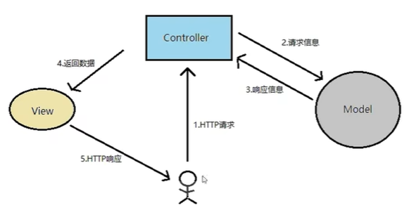
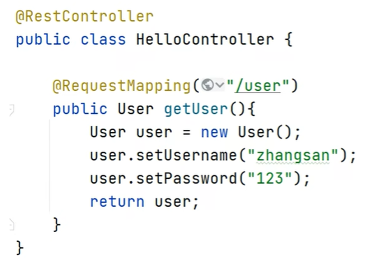
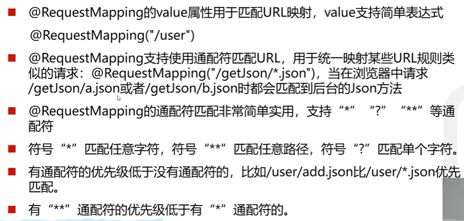
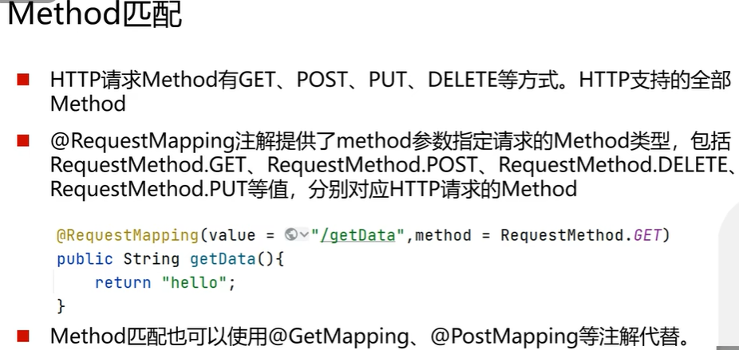
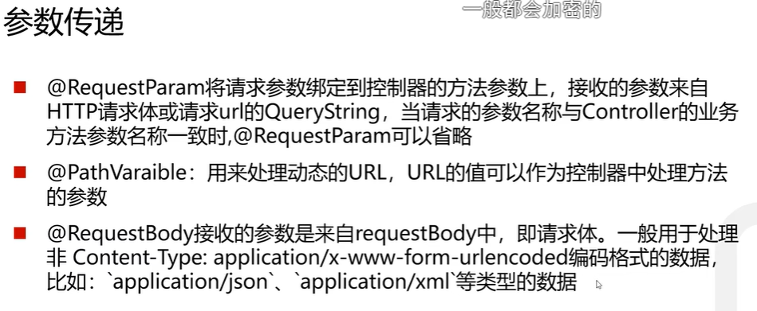
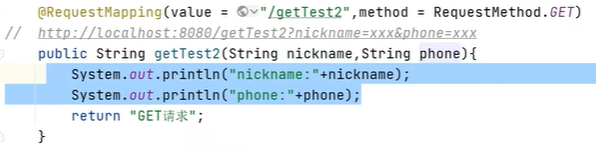
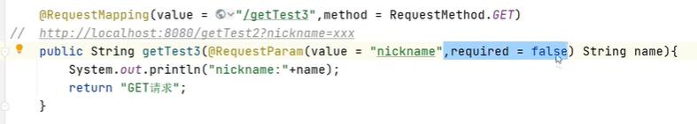
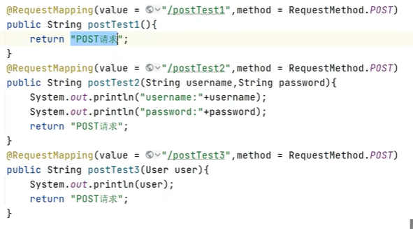
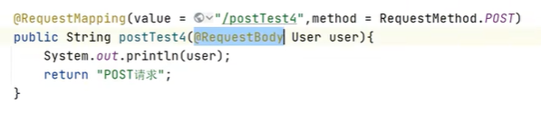

# SpringBoot笔记

### Model-Servlet-DAO 结构
1. Model（模型）
定义：Model 是应用程序的数据表示层，通常用来封装业务逻辑和数据处理。它通常是由 Java 类构成的，用于表示业务对象（例如 User、Product、Order 等）。
   
作用：保存和处理应用程序的数据，并与数据库交互以获取和存储数据。Model 类通常包含属性、getter/setter 方法、业务逻辑和验证规则

2. Servlet（控制器）

定义：Servlet 是 Java Web 应用中的控制器，用于处理 HTTP 请求和响应。它接受来自用户的请求、处理业务逻辑，并将结果返回给前端（视图）。
   
作用：Servlet 负责处理请求、调用业务逻辑（通常通过 Model 和 DAO），然后将处理结果传递给前端（JSP 或其他视图模板）。

3. DAO（数据访问对象）

定义：DAO (Data Access Object) 模式用于封装数据访问逻辑。DAO 类专门用于与数据库交互，负责执行 CRUD（创建、读取、更新、删除）操作。

作用：通过 JDBC 或 ORM 框架（如 Hibernate）与数据库连接，从而对数据库中的表进行操作。
### spring-boot-devtools
无须手动重启springboot即可重新编译，启动
可以监听classpath下面的文件变动，触发restart类，加载修改后的类

### Controller
MVC 模式，Model 存储数据，Controller协调和控制, View展示显示数据
响应HTTP请求，把返回数据给View

@Controller 请求的是页面（View）和数据，
@RestController 只请求数据,转为JSON格式

### 路由映射
@RequestMapping 负责URL的路由映射,涉及以下几个参数：

value: 请求的URL路径

method: HTTP请求方法（GET/POST)

consumes (optional): 请求的类型（Content-Type), application/json

produce (optional): 响应的媒体类型， html， json啊

params, headers (optional): 请求的参数及请求头的值

### 参数传递
1，GET

//前端传递方式 hello?nickname=zhangsan
//前端多个参数传递方式,使用&拼接 hello?nickname=zhangsan&phone=123
@GetMapping("/hello")
    public String hello(String nickname){//入参和这个传递一致
    return "Hello world" + nickname;
}

 required是false代表是可选的

2. POST

不传参数

传递参数

可以传对象（User user），属性（参数）名称前后端一致

传递JSON类型
